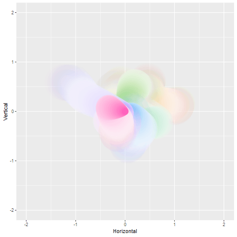
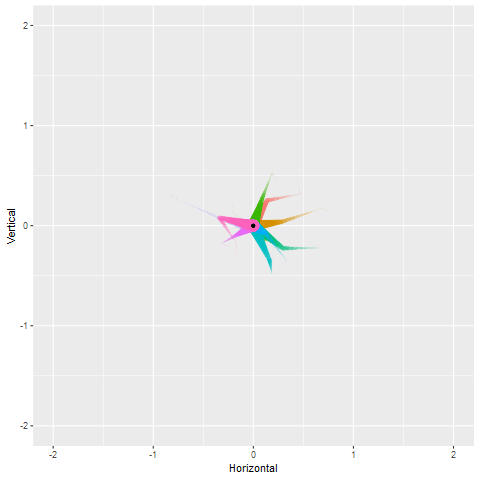

# Brownian bridge animations

Contains scripts (not particularly well organised) used to draw various "Brownian bridge" animations that I used to explore some of the functionality of the gganimate package. 

The animation produced in the `bridge1_simple` folder:

The animation produced in the `bridge2_chdss` folder:

The animation produced in the `bridge3_wearitpurple` folder

The animation produced in the `bridge4_eels` folder

There are several animations produced in the `bridge5_shadowwake` folder, cached in the `shadow_wake_files` subdirectory. A couple of examples:

